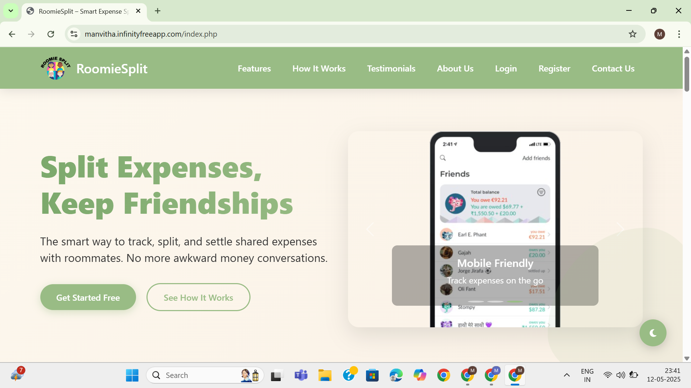
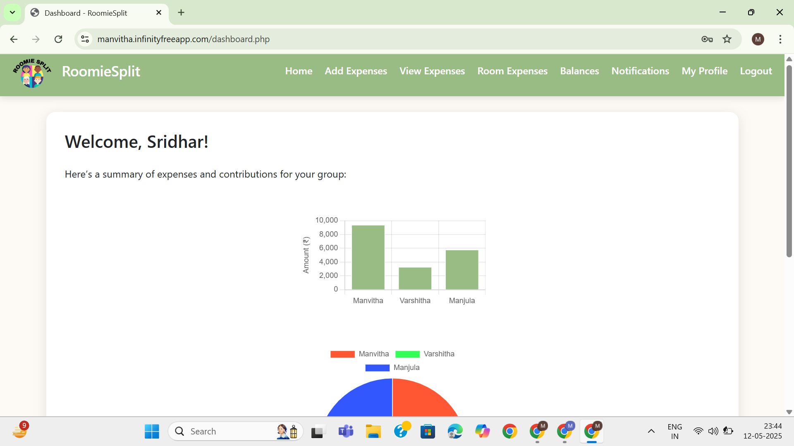
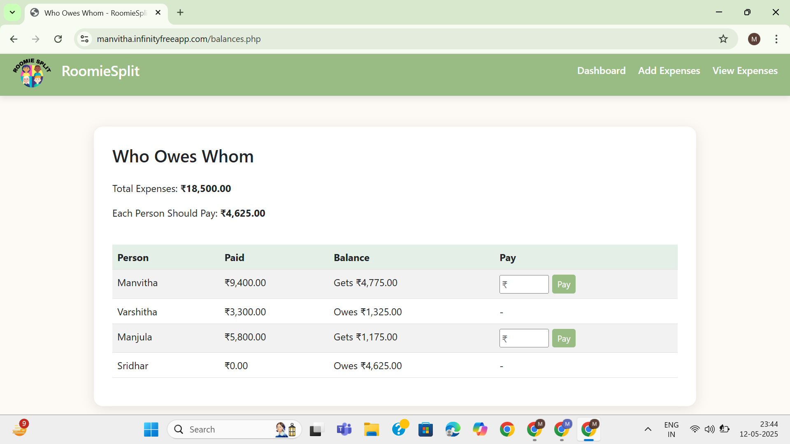
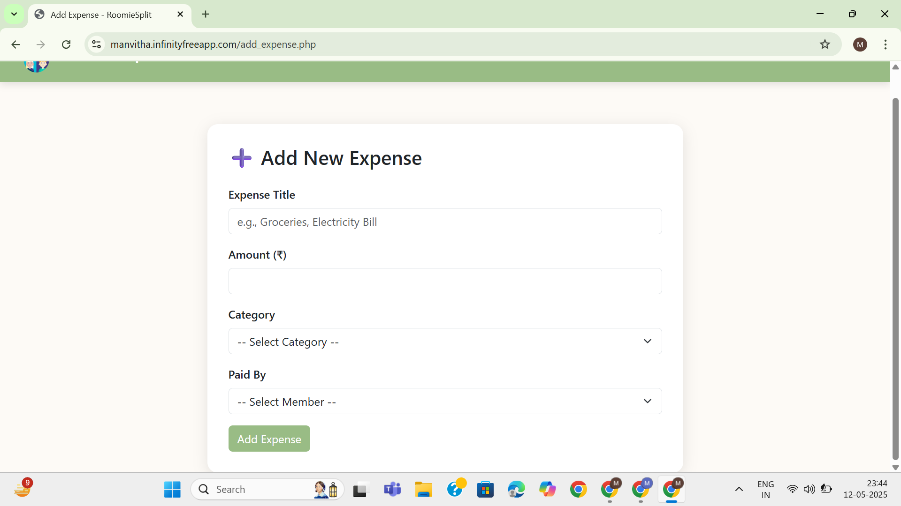

# RoomieSplit – Smart Expense Splitter for Roommates

**Tagline**: Split bills. Settle up. Stay stress-free.

---

## Table of Contents
- [Problem Statement](#problem-statement)
- [Abstract](#abstract)
- [Introduction](#introduction)
- [Features](#features)
- [Tech Stack](#tech-stack)
- [Screenshots](#screenshots)
- [Installation](#installation)
- [Usage](#usage)
- [Database Schema](#database-schema)
- [Live Demo](#live-demo)

---

## 📌 Problem Statement
In shared living situations, roommates often face challenges in managing and splitting common expenses fairly. Without a clear system, misunderstandings and disputes over who paid what can arise. Current methods of expense tracking, such as manual calculations or simple spreadsheets, are inefficient, error-prone, and lack transparency. This project addresses the need for an easy-to-use, automated solution to track and split expenses in shared living arrangements.

---

## 📝 Abstract
RoomieSplit is a web-based application designed to help roommates easily manage and split shared expenses. The application provides a user-friendly interface for adding, updating, and categorizing expenses, and automatically calculates the amount each roommate owes. The app includes features for tracking payments, visualizing expenses, and exporting data for record-keeping. By automating expense calculations and providing clear, transparent reporting, RoomieSplit simplifies financial management and helps avoid conflicts among roommates.

---

## 📌 Introduction
RoomieSplit is a full-stack web application that allows roommates to track shared expenses, manage debts, and settle up without confusion. It helps users add expenses, categorize them, and automatically calculate who owes whom. The app ensures smooth financial management and transparency among housemates, making it easier to manage bills and shared costs.

This tool is perfect for anyone living with roommates and looking for a simple, automated way to handle finances and avoid misunderstandings about shared expenses.

---

## ✨ Features
- **Add and manage expenses**: Quickly add, update, and delete shared expenses.
- **Category-based filtering**: Filter expenses by categories like rent, food, internet, etc.
- **'Who owes whom' calculation**: Automatically calculate who owes whom and how much.
- **Settle up**: Make payments and clear balances with roommates.
- **PDF/CSV export**: Export the expense data as PDFs or CSV files for record-keeping.
- **Dashboard charts**: Visualize expenses with dynamic charts and graphs.
- **Monthly summaries**: View expense summaries by month and category for better tracking.

---

## 🛠 Tech Stack
- **Frontend**: HTML, CSS, JavaScript
- **Backend**: PHP
- **Database**: MySQL (via phpMyAdmin)
- **Libraries/Tools**: Chart.js for charts, Bootstrap for responsive UI

---

## 📸 Screenshots






---

## 📦 Installation

### Prerequisites
- XAMPP/Laragon (or any local PHP server)
- phpMyAdmin for MySQL management

### Steps to install:
1. **Clone the repository**:
   ```bash
   git clone https://github.com/ManvithaPola/Roomiesplit.git
